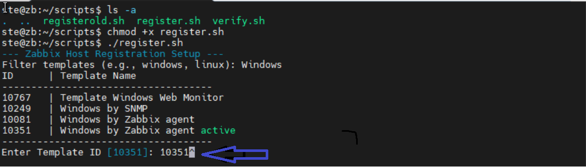
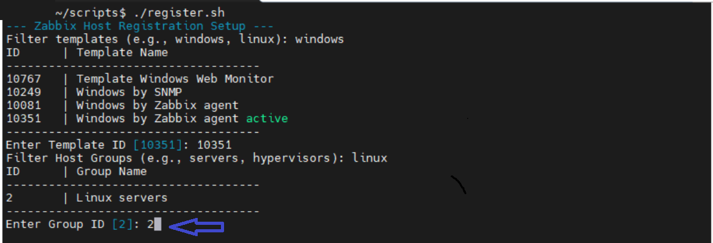
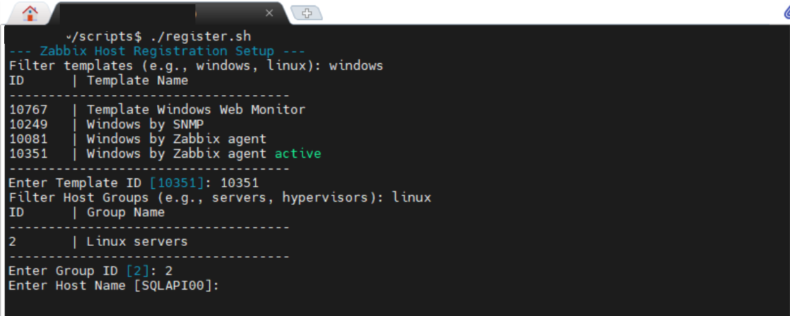
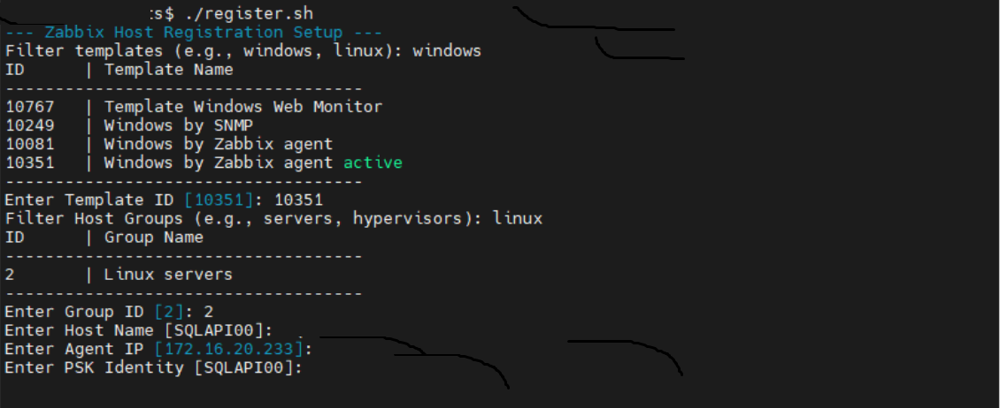

# Zabbix Host Registration Automation 🚀

The `register_zabbix_host.sh` script is an advanced automation utility designed for Senior Systems Engineers to streamline the onboarding of new servers into Zabbix using the **JSON-RPC API**.

## 🌟 Key Features
* **Smart Template Lookup**: Includes a built-in filter to search for Zabbix templates by name directly from the API.
* **Automated PSK Integration**: Automatically reads and injects Pre-Shared Key (PSK) values from `/etc/zabbix/psk.key`.
* **API-Driven Registration**: Uses `host.create` methods to link templates, set groups, and configure TLS encryption in one step.
* **Post-Registration Audit**: Automatically runs a network test using `nc` (netcat) to verify port `10050` is reachable after the host is created.

## 🛠️ Requirements & Security
### 📋 Prerequisites
* **Packages**: `jq` (JSON processor), `curl`, and `nc` (netcat).
* **Zabbix Permissions**: An API token with **Admin** or **Super Admin** rights.

### 🔐 Security Best Practice
**Do not hardcode your secrets!** Use environment variables to run the script safely:

****
1) Choosing the zabbix template:

2) Enter Group ID from zabbix home groups:

3) Register host agent name:

4) Register the IP and PSKI ID or agent:


```bash
export ZABBIX_URL="http://your-zabbix-url/api_jsonrpc.php"
export ZABBIX_TOKEN="your_private_token"


